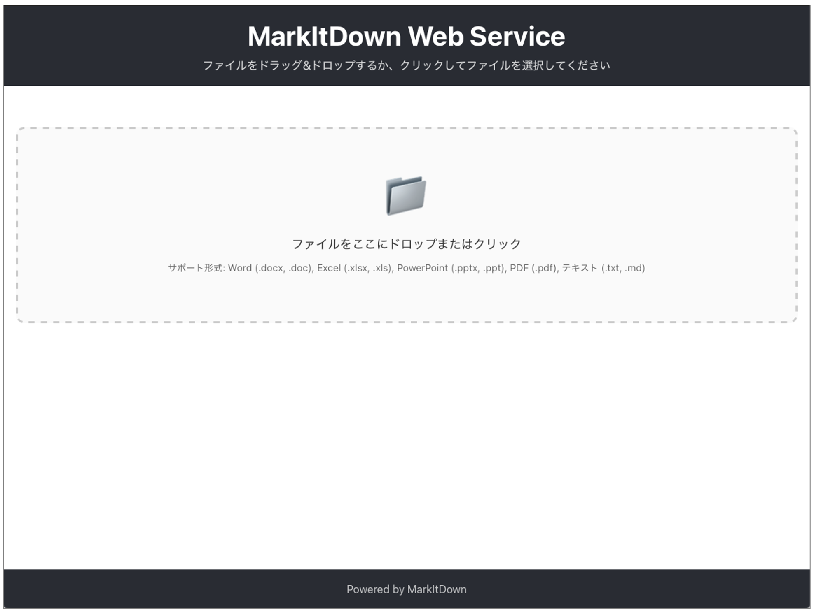
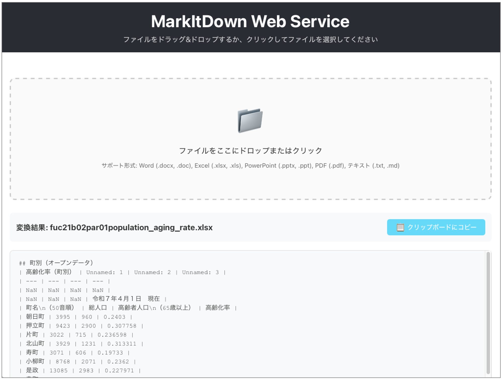

# MarkItDown Web Service

ファイルをMarkdownに変換するWebサービスです。React SPA + AWS CDKで構築されています。
AWS CDKでデプロイすることができます。

markitdownは、Microsoft Word、Excel、PowerPoint、PDF、テキストファイルなどをMarkdownに変換するライブラリです。
https://github.com/microsoft/markitdown

当仕組みは、markitdownをローカルにインストールすることなくWebサービスとして簡単に試せるようにするものです。

## Language

Currently only supports Japanese language.

## 機能

- ドラッグ&ドロップまたはクリックでファイルアップロード
- 対応形式: Word (.docx, .doc), Excel (.xlsx, .xls), PowerPoint (.pptx, .ppt), PDF (.pdf), テキストファイル (.txt, .md)
- Markdownへの変換とブラウザ表示
- クリップボードへのコピー機能
- アップロードされたファイルは破棄され、サーバ側に保持されることはない（そのように実装していますが利用される際には機密情報を含むファイルは避けるなどご注意ください）
- [オプション]IPアドレス制限（AWS WAFを使用, IPv4のみ対応しています）

## 画面イメージ






## アーキテクチャ

- **フロントエンド**: React SPA (TypeScript)
- **バックエンド**: AWS Lambda (Python, Docker)
  - markitdownの依存をすべて利用する場合`markitdown[all]`、AWS Lambdaのレイヤーサイズの制限に収まらないため、Dockerを使用してLambda関数をデプロイする構成になっています。
- **API**: Amazon API Gateway (REST API)
- **SPAサーブ**: Amazon S3 + CloudFront
- **ビルド**: deploy-time-build (ビルド時API URL注入)


## デプロイについての補足事項

本プロジェクトではフロントエンドはReactベースのSPAアプリで実装されておりバックエンドはAPI Gatewayとなっています。
cdk deployのみでアプリのビルドとAPIエンドポイントの設定が完了するよう、deploy-time-buildを利用しています。

https://github.com/tmokmss/deploy-time-build

## IPアドレス制限

AWS WAFを利用したアクセス元のIP制限が可能です。  
設定する場合は、 `cdk.json`にIPアドレスを指定してください。

```json
{
  "context": {
    "allowedIpAddresses": [
      "x.x.x.x/32",
      "y.y.y.y/29"
    ]
  },
}
```

## 注意事項

IPアドレス制限を行う場合、CloudFront用のAWS WAFのWebACLは`us-east-1`リージョンに作成されます。

## セットアップ

### 前提条件

AWS CDKが必要です。

実行のための権限設定は別途実施済みとします。
aws configure等でプロファイルを用意するなどご準備ください。

```sh
export AWS_PROFILE=your-profile-name
```

### AWS環境へのデプロイ

```sh
npm run deploy
```

cdk deployが実行されます。  
成功すると最後にCloudFrontのURLが表示されます(MarkitdownWebStack.WebsiteURL)ので、ブラウザアクセスすることでWebアプリを利用可能です。

```sh
Outputs:
MarkitdownWebStack.ApiEndpoint = https://xxxxxxxxxx.execute-api.ap-northeast-1.amazonaws.com/prod/
MarkitdownWebStack.BucketName = markitdown-website-000000000000-ap-northeast-1
MarkitdownWebStack.MarkitdownApiEndpoint1DBDBA93 = https://xxxxxxxxxx.execute-api.ap-northeast-1.amazonaws.com/prod/
MarkitdownWebStack.WebsiteURL = https://xxxxxxxxxxxxxx.cloudfront.net
```


### 削除

```
npm run destroy
```

### ローカルでフロントエンドを起動する場合

```bash
# 依存関係のインストール
npm install
cd frontend && npm install && cd ..

# フロントエンドの開発サーバー起動（ローカル開発時）
cd frontend && npm start
```

## プロジェクト構造

```
markitdown-website/
├── bin/                    # CDK アプリエントリーポイント
├── lib/                    # CDK スタック定義
├── lambda/                 # Lambda関数コード
│   ├── Dockerfile         # Lambda用Dockerイメージ
│   ├── lambda_function.py # メイン関数
│   └── requirements.txt   # Python依存関係
├── frontend/              # React SPA
│   ├── src/
│   ├── public/
│   └── package.json
├── cdk.json               # CDK設定
├── package.json           # プロジェクト設定
└── README.md
```


### 対応ファイル形式

Lambda関数内で`markitdown`ライブラリを使用して以下の形式をサポート：

- Microsoft Word (.docx, .doc)
- Microsoft Excel (.xlsx, .xls)  
- Microsoft PowerPoint (.pptx, .ppt)
- PDF (.pdf)
- テキストファイル (.txt, .md)

## ライセンス

MIT License
